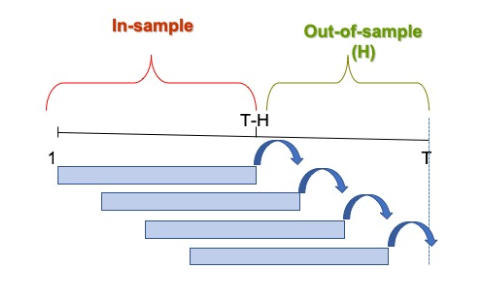
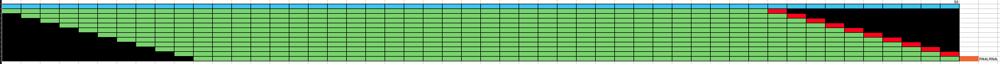

# Parcial práctico
## ToDO
- Librerias
- Importar el dataset
### Parte 1
- EDA 
  - Reconocimiento de la info
  - Estadísticas de tendencia central
    - Media
    - Mediana
    - Cantidad de datos
    - Nulos
  - Plot inicial de las series
    - Tendencia
  - Identificación de los componentes de la serie (Plot de los componentes)
    - Tendencia
    - Estacionalidad
    - Ruido
### Parte 2 Protocolos de evaluación
- 
- 
- Definir la ventana - iteraciones
### Parte 3 Modelos
- Promedio Movil
  - No supuestos
- Suavizacion exponencial Holt-winters
  - No supuestos
- Modelos de regresión
  - Si Supuestos
  - Polinomios + Estacionalidad
    - 1
    - 2
    - 3
    - 4
    - 5
- ARIMA
  - Si Supuestos
### Parte 4
- Escoger modelo (RMSE)
- Si gana un modelo con supuestos, evaluar los supuestos
- Pronóstico
- mimir
### Parte 5 conclusiones
- 4 pag de informe

